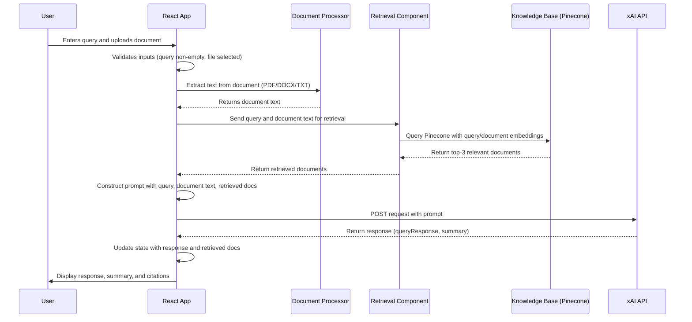

# Legal Query Assistant with RAG

## Overview

The Legal Query Assistant is a single-page web application built with React, TypeScript, Vite, and Tailwind CSS v4. It allows users to input legal queries and upload documents (PDF, DOC, DOCX, TXT), receiving AI-driven responses and summaries powered by the xAI API. The application integrates a **Retrieval-Augmented Generation (RAG)** system to enhance response accuracy by retrieving relevant legal documents from a knowledge base, grounding the xAI API's outputs in domain-specific context.

## Retrieval-Augmented Generation (RAG) System

### Purpose

The RAG system combines retrieval and generation to provide precise, legally accurate responses. It retrieves relevant legal documents (e.g., statutes, case law) to contextualize the user's query and uploaded document, reducing hallucinations and improving relevance for legal queries.

### Components

1. **Knowledge Base**:

   - A Pinecone vector database stores embeddings of legal documents, generated using Sentence Transformers (`all-MiniLM-L6-v2`).
   - Contains statutes, case law, and firm-specific templates, updated periodically.

2. **Retrieval Component**:

   - Uses LangChain to:
     - Convert queries and document text to embeddings.
     - Query Pinecone for the top-3 relevant documents based on cosine similarity.
     - Fallback to keyword-based search (BM25) if needed.
   - Returns document content and metadata (e.g., title, source).

3. **Generation Component**:

   - The xAI API generates responses using a structured prompt that includes:
     - User query.
     - Uploaded document text (extracted via `pdf-parse` or `mammoth`).
     - Retrieved documents.
   - Advanced prompt engineering (chain-of-thought, role-based instructions) ensures accurate, cited responses.

4. **Data Flow**:
   - User submits a query and document via the UI.
   - The app validates inputs, extracts document text, and retrieves relevant documents.
   - A prompt is constructed and sent to the xAI API.
   - The response, including a query analysis, document summary, and citations, is displayed.

### Benefits

- **Accuracy**: Grounds responses in relevant legal documents, minimizing errors.
- **Relevance**: Retrieves domain-specific context for complex legal queries.
- **Scalability**: Supports large knowledge bases without retraining the LLM.
- **User Experience**: Displays citations for transparency and trust.

## RAG Workflow Sequence Diagram

The following Mermaid diagram illustrates the RAG system's workflow, from user input to response display:

## Setup and Rendering

To view the Mermaid diagram:

- **GitHub**: Push this `README.md` to a repository; GitHub will render the diagram automatically.
- **VS Code**: Use the **Markdown Preview Mermaid Support** extension and open the preview (Ctrl+Shift+V).
- **Online**: Copy the Mermaid code into [Mermaid Live Editor](https://mermaid.live/) for instant rendering.
- **Local Website**: Include the Mermaid library (``) and initialize with `mermaid.initialize({ startOnLoad: true });`.

## Installation

1. Clone the repository: `git clone https://github.com/atafs/staffengineer-poc-03-llm`
2. Install dependencies: `npm install`
3. Set up environment variables in `.env`:
   - `VITE_XAI_API_KEY`: xAI API key
   - `VITE_PINECONE_API_KEY`: Pinecone API key
4. Run the development server: `npm run dev`
5. Open the app at `http://localhost:5173`

## Dependencies

- React: ^18.3.1
- TypeScript: ^5.5.3
- Vite: ^5.4.8
- Tailwind CSS: ^4.0.0
- pdf-parse: ^1.1.1
- mammoth: ^1.8.0
- @pinecone-database/pinecone: ^2.0.0
- @langchain/core: ^0.2.0
- sentence-transformers: ^2.2.2

## Demo

- [Google Drive Demo](https://drive.google.com/file/d/1ufLm__DWrcAxNlO2djz72UCxMzBLFSc3/view?usp=drive_link)
